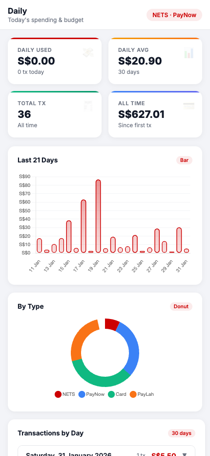
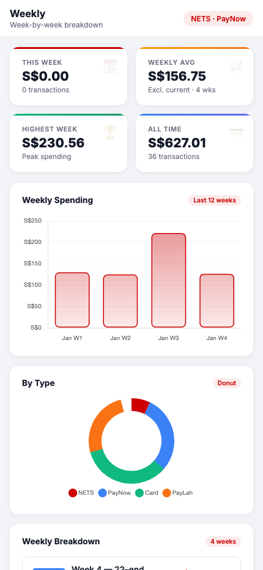
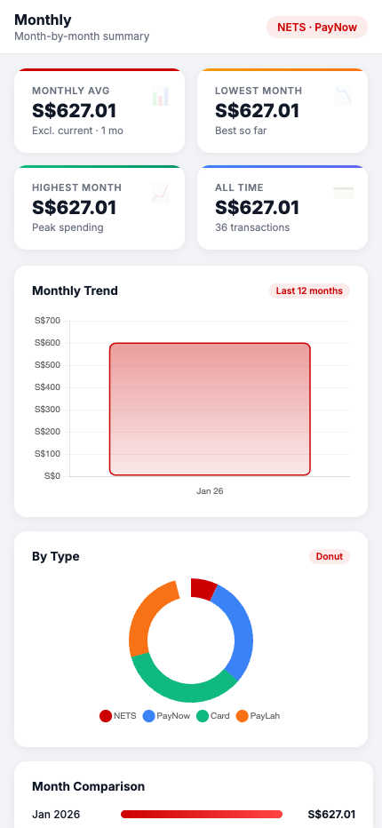
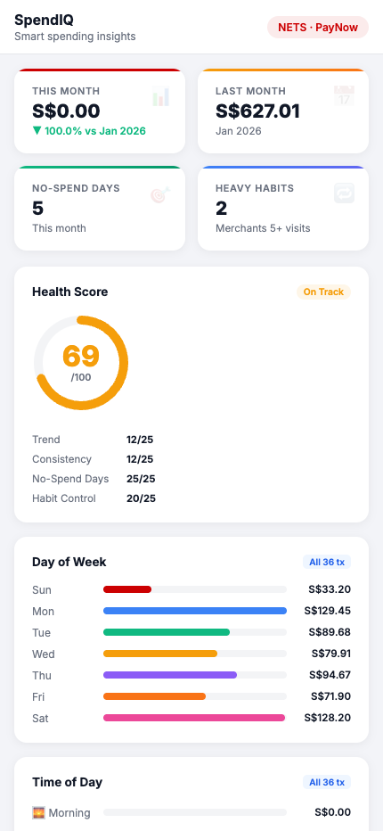

# Finsight — DBS Personal Finance Dashboard

A personal expense tracker that parses your DBS Consolidated Statement PDFs and displays them as a clean, mobile-friendly dashboard.

## Screenshots

<table>
  <tr>
    <td align="center"><b>Daily</b></td>
    <td align="center"><b>Weekly</b></td>
  </tr>
  <tr>
    <td></td>
    <td></td>
  </tr>
  <tr>
    <td align="center"><b>Monthly</b></td>
    <td align="center"><b>SpendIQ</b></td>
  </tr>
  <tr>
    <td></td>
    <td></td>
  </tr>
</table>

## Features

- **Daily** — daily spending total, daily average, 21-day bar chart, top 25 merchants
- **Weekly** — week-by-week breakdown (W1–W4), spending trends
- **Monthly** — month-over-month comparison, top 15 merchants, per-month frequency & spend breakdown
- **SpendIQ** — financial health score, day/time heatmaps, saving tips
- Upload multiple PDF statements at once
- Optionally sync current month via Gmail (requires Google OAuth setup)
- Data resets every time the server restarts — nothing is stored permanently

## Setup

### 1. Install dependencies
```bash
npm install
```

### 2. Start the server
```bash
node server.js
```

Opens [http://localhost:5174](http://localhost:5174) automatically.

### 3. Upload your statements
Click **Upload Statement** in the sidebar and select your DBS Consolidated Statement PDF(s). Multiple files can be uploaded at once.

### 4. Try the demo
Click **Load Demo** in the sidebar to explore the dashboard with a sample January 2026 statement.

## Updating Data

Each time you restart the server, data is cleared. Re-upload your PDFs to repopulate.

**To add the current (incomplete) month**, set up Gmail sync below — it fetches transactions from your DBS email alerts.

## Optional — Gmail Sync for Current Month

This lets you pull the current month's transactions from your DBS email notifications.

### 1. Create Google OAuth credentials
- Go to [Google Cloud Console](https://console.cloud.google.com/)
- Create a project → Enable **Gmail API**
- Create **OAuth 2.0 Client ID** (Desktop app type)
- Download as `credentials.json` and place it in the project root

### 2. Authenticate (first time only)
```bash
node fetchEmails.js
```
Follow the printed URL, sign in, paste the auth code back. This saves `token.json`.

### 3. Use Sync Current Month
Click **Sync Current Month** in the sidebar.

> `credentials.json` and `token.json` are gitignored — they are yours only and never shared.

## Project Structure

```
├── fetchEmails.js          Gmail API fetcher (optional, current month only)
├── generateDummyStatement.js  Generates docs/demo-statement.pdf for testing
├── parseBankStatement.js   DBS PDF statement parser
├── server.js               Express server (port 5174)
├── public/
│   ├── index.html          Dashboard
│   └── demo-statement.pdf  Sample statement for demo
├── docs/screenshots/       Dashboard screenshots
```

## Tech Stack

- **Frontend** — Vanilla JS, Chart.js, Inter font
- **Backend** — Node.js, Express
- **PDF Parsing** — pdf-parse
- **Email** — Gmail API (optional)
